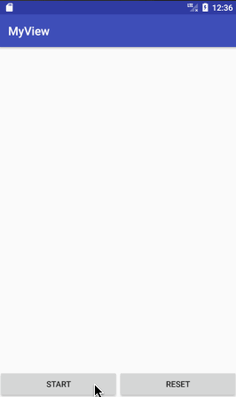

**关注我**

githup:[https://github.com/yyj001](https://github.com/yyj001)

ResultView
====
##简介
对处理事件响应的一个小动画库

*  **demo**



**一些特点：**
1. 可以自定义颜色
2. 自定义时长
3. 自定义内部尺寸

### how to use

 - **Add it in your root build.gradle at the end of repositories:**
 ```
	    allprojects {
		   repositories {
			...
			maven { url 'https://jitpack.io' }
		}
	    }
```
 -  **Add the dependency**
```sh
	dependencies {
	        compile 'com.github.yyj001:ResultView:v1.0'
	}
```

- **add ResultView to your layout**
  
```xml
   <com.ish.mylibrary.mView.ResultView
        android:layout_width="100dp"
        android:layout_height="100dp"
        />
```
- **some properties**
```xml
<com.ish.mylibrary.mView.ResultView
        android:layout_width="100dp"
        android:layout_height="100dp"
        android:layout_centerInParent="true"
        app:back_color="@color/white"
        app:theme_color="@color/green"
        app:mType="TYPE_FAILD"
        app:duration="2000"
        app:ring_width="3dp"
        />
```
some jave methods
```java
        resultView.setBackColor(R.color.red);
        resultView.setThemeColor(R.color.white);
        resultView.setDuration(2000);
        resultView.setRingWidth(3);
        resultView.setType(ResultView.TYPE_WARN);
```
- **play and reset the animation**
```java
        resultView.play();
        resultView.reset();
```

‘’
